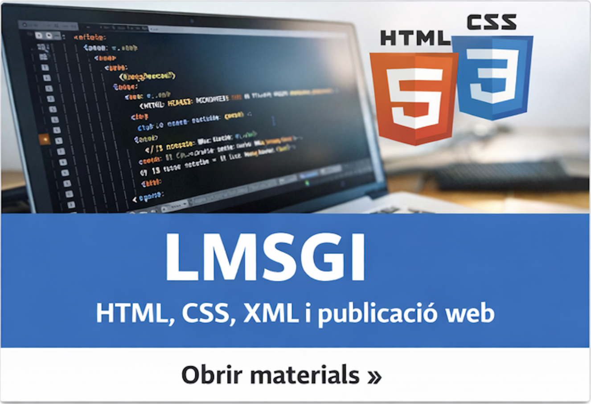
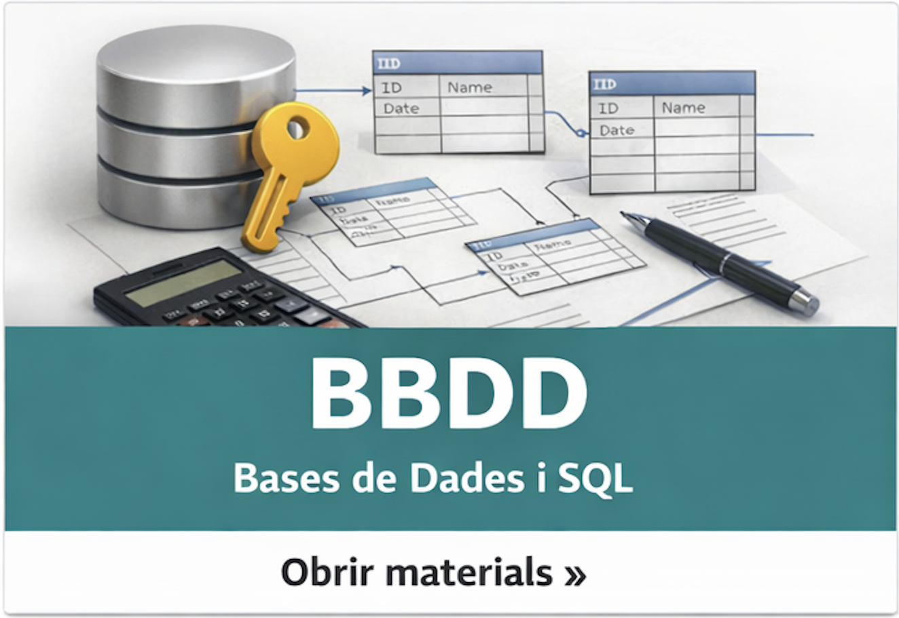

# manaloarg.github.io

Hola! Sóc **Manuel Alonso Argente**, professor de **Formació Professional** a l’**IES Mestre Ramon Esteve** (Catadau).  
Actualment impartisc, dins del cicle de **Desenvolupament d’Aplicacions Web (DAW)**, els mòduls de:

- **LMSGI** — Llenguatges de Marques i Sistemes de Gestió d’Informació  
- **BBDD** — Bases de Dades  

Aquesta pàgina és una porta d’entrada ràpida als materials i a les activitats de cada mòdul.

## Mòduls (DAW)

  <a href="./LLMSGI" style="text-decoration:none; color:inherit;">
    

      
      

        
LMSGI

        

          HTML, CSS, JS, XML, JSON i validació. Pràctica, exemples i exercicis guiats.
        

        
👉 Obrir materials

      

    

  </a>

  <a href="./BBDD" style="text-decoration:none; color:inherit;">
    

      
      

        
BBDD

        

          Model relacional, SQL, consultes, claus i relacions. Activitats pas a pas i casos pràctics.
        

        
👉 Obrir materials

      

    

  </a>

